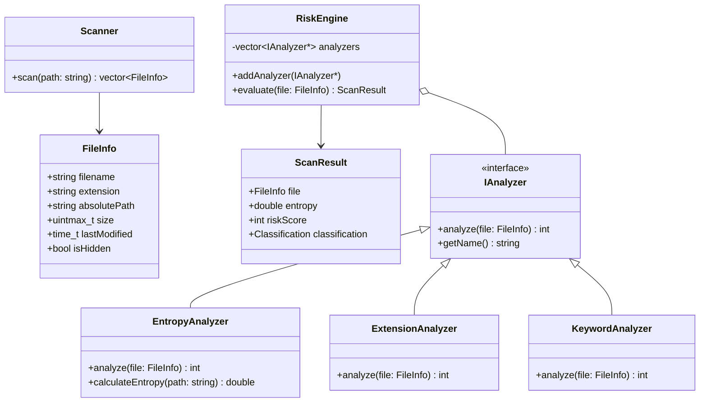
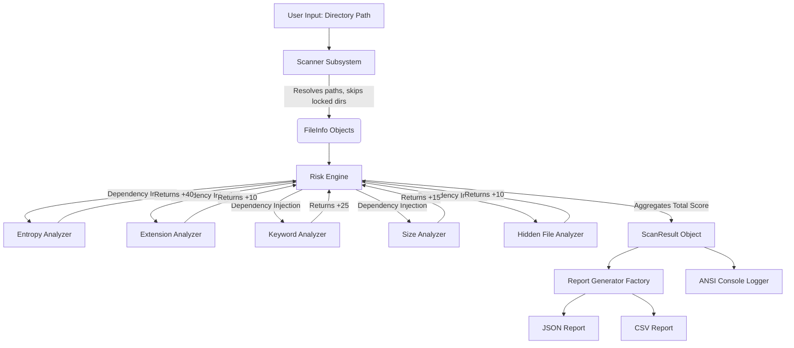

# MalScan++: Production-Ready Technical Specification

## 1. System Architecture
MalScan++ is designed as a modular, high-performance static analysis pipeline. 
* **Scanner Subsystem**: Interfaces with the OS to recursively map files and generate `FileInfo` models.
* **Analysis Pipeline**: A pluggable architecture where files are evaluated by discrete, stateless `IAnalyzer` implementations.
* **Risk Engine**: The central aggregator. It evaluates the outputs of the Analyzers against a configurable threshold system to assign a final categorical risk.
* **Reporting Subsystem**: Transforms internal `ScanResult` structs into standardized data formats (JSON/CSV).

## 2. Folder Structure
```text
MalScan++/
├── CMakeLists.txt
├── vcpkg.json
├── README.md
├── .gitignore
├── include/
│   ├── core/
│   │   ├── Scanner.h
│   │   ├── RiskEngine.h
│   │   └── Models.h
│   ├── analyzers/
│   │   ├── IAnalyzer.h
│   │   ├── EntropyAnalyzer.h
│   │   ├── ExtensionAnalyzer.h
│   │   ├── KeywordAnalyzer.h
│   │   ├── SizeAnalyzer.h
│   │   └── HiddenFileAnalyzer.h
│   ├── reporting/
│   │   ├── IReportGenerator.h
│   │   ├── JsonReportGenerator.h
│   │   └── CsvReportGenerator.h
│   └── utils/
│       ├── Logger.h
│       └── FileUtils.h
├── src/
│   ├── main.cpp
│   ├── core/
│   │   ├── Scanner.cpp
│   │   └── RiskEngine.cpp
│   ├── analyzers/
│   │   ├── EntropyAnalyzer.cpp
│   │   ├── ExtensionAnalyzer.cpp
│   │   ├── KeywordAnalyzer.cpp
│   │   ├── SizeAnalyzer.cpp
│   │   └── HiddenFileAnalyzer.cpp
│   ├── reporting/
│   │   ├── JsonReportGenerator.cpp
│   │   └── CsvReportGenerator.cpp
│   └── utils/
│       ├── Logger.cpp
│       └── FileUtils.cpp
└── tests/
    ├── CMakeLists.txt
    ├── test_main.cpp
    ├── EntropyAnalyzerTests.cpp
    ├── RiskEngineTests.cpp
    └── ExtensionAnalyzerTests.cpp
```

## 3. Class Diagram



## 4. Data Flow Diagram



## 5. Component Responsibilities & Implementation Details

### A. Scanner (std::filesystem)
* **Responsibility**: Map directories iteratively.
* **Implementation**: Use `std::filesystem::recursive_directory_iterator`.
* **Critical Design Choice**: Construct the iterator with `std::filesystem::directory_options::skip_permission_denied`. If you don't do this, traversing paths like `C:\System Volume Information` will throw a fatal `std::filesystem::filesystem_error` and crash the program.

### B. FileInfo Model
```cpp
struct FileInfo {
    std::string filename;
    std::string extension; // e.g., ".exe"
    std::string absolutePath;
    uintmax_t size;
    std::time_t lastModified;
    bool isHidden;
};
```

### C. The `IAnalyzer` Interface
* **Responsibility**: Enforce a strict contract for heuristic plugins.
```cpp
class IAnalyzer {
public:
    virtual ~IAnalyzer() = default;
    virtual int analyze(const FileInfo& file) = 0; // Returns risk score integer
    virtual std::string getName() const = 0;
};
```

### D. Shannon Entropy Analysis
* **Why it matters**: Standard PE files have an entropy of ~4-5. Threat actors pack or encrypt malware payloads to evade signature detection, resulting in highly randomized byte distributions (entropy > 7.2).
* **Formula**: $H = -\sum_{i=0}^{255} p_i \log_2(p_i)$
* **Implementation Details**:
  1. Open file using `std::ifstream` in `std::ios::binary` mode.
  2. Create an array `size_t counts[256] = {0};`
  3. **Memory Safety**: DO NOT read the whole file into a `std::string`. Read in chunks (e.g., 8192 bytes) using `file.read()`. Update the frequency map.
  4. Compute probabilities and sum the entropy.
* **Score**: If `H > 7.5`, return `+40`. If `H > 6.8`, return `+20`.

### E. Suspicious Extension Analysis
* **Why**: Formats interpreted directly by the OS.
* **Implementation**: Check against a `std::unordered_set<std::string>` containing `.exe`, `.dll`, `.bat`, `.ps1`, `.vbs`, `.scr`, `.cmd`, `.js`, `.jar`, `.msi`.
* **Score**: Return `+10`.

### F. Double Extension Detection
* **Why**: Social engineering. Windows hides known file extensions by default. `invoice.pdf.exe` appears as `invoice.pdf`.
* **Implementation**: Regex `\.[a-zA-Z0-9]+\.(exe|scr|bat|vbs|cmd)$` or count `.` occurrences.
* **Score**: Return `+30`.

### G. Hidden File Detection
* **Why**: Malware drops payloads in hidden user directories.
* **Implementation**: 
  * Windows (`#ifdef _WIN32`): Call `<windows.h>` `GetFileAttributesA()`. Check `attributes & FILE_ATTRIBUTE_HIDDEN`.
  * Linux (`#else`): Check if `file.filename[0] == '.'`.
* **Score**: Return `+10`.

### H. Suspicious Keyword Detection
* **Why**: Threat actors often leave traces of tooling frameworks.
* **Implementation**: Scan filenames/paths for `crack`, `keygen`, `hack`, `injector`, `payload`, `stealer`, `miner`. (Convert to lowercase before comparison).
* **Score**: Return `+25`.

### I. Large Executable Detection
* **Why**: Bypassing cloud scanners (like VT's size limits) by appending gigabytes of zero-padding.
* **Implementation**: If `size > 50MB` AND `extension == .exe`, flag it.
* **Score**: Return `+15`.

### J. Risk Engine
* **Logic**: Initializes `totalScore = 0`. Iterates over a vector of registered `IAnalyzer*`. Sums the returned ints.
* **Classification Thresholds**:
  * `0 - 20`: `SAFE`
  * `21 - 50`: `SUSPICIOUS`
  * `> 50`: `HIGH_RISK`

### K. Reporting & Logger
* **JSON Output**: Use `nlohmann::json`.
* **ANSI Logger**:
  * RED: `\033[31m` (HIGH_RISK)
  * YELLOW: `\033[33m` (SUSPICIOUS)
  * GREEN: `\033[32m` (SAFE)
  * RESET: `\033[0m`

## 6. Design Patterns Evaluation
* **Strategy Pattern (YES)**: Highly recommended. It fits the `IAnalyzer` architecture perfectly, enforcing the Open/Closed Principle. You can add a `MachineLearningAnalyzer` later without touching `RiskEngine.cpp`.
* **Factory Pattern (YES)**: Useful for instantiation of output formats (`ReportFactory::create("json")`).
* **Singleton (NO)**: Overkill and introduces global state. Avoid a Singleton `Logger` or `RiskEngine`. Use Dependency Injection instead.
* **Dependency Injection (YES)**: Passing the Analyzers directly into the `RiskEngine` allows for seamless unit testing (injecting mock analyzers).

## 7. Coding Order
1. **Core Skeleton**: Setup CMakeLists.txt, vcpkg.json, folder structures.
2. **Models & Utils**: Create `FileInfo`, `ScanResult`, and ANSI `Logger`.
3. **Scanner**: Build the directory iterator. Test it against a dummy folder.
4. **Simple Analyzers**: `ExtensionAnalyzer`, `SizeAnalyzer`, `HiddenFileAnalyzer`, `DoubleExtensionDetector`.
5. **Complex Analyzers**: `EntropyAnalyzer`. Test memory usage on large ISO files.
6. **Risk Engine**: Assemble the pieces.
7. **Reporting**: Implement JSON serialization.

## 8. Build Configuration & Required Libraries
* **Language**: C++20
* **Build System**: CMake (v3.20+)
* **Package Manager**: vcpkg
* **Libraries**: 
  * `nlohmann/json` (Serialization)
  * `gtest` (GoogleTest framework)
  * `cxxopts` (Optional, for clean CLI argument parsing)

## 9. Testing Strategy
* **Framework**: GoogleTest.
* **Key Unit Tests**:
  1. `EntropyCalculation_ReturnsCorrectMath`: Feed a file of all 'A's (entropy 0.0). Feed a file of perfectly distributed random bytes (entropy 8.0).
  2. `RiskEngine_AccumulatesScoresCorrectly`: Inject mock analyzers returning 10, 20, 30. Ensure total is 60 and class is HIGH_RISK.
  3. `DoubleExtension_DetectsEdgeCases`: Test `invoice.pdf.exe` (True), `archive.tar.gz` (False).

## 10. Future Security Features (Ranked)
1. **SHA256 Hashing** *(Resume Value: High, Difficulty: Low)*: Essential for matching IOCs (Indicators of Compromise) against threat intelligence feeds.
2. **YARA Support** *(Resume Value: Very High, Difficulty: Medium)*: Integrate `libyara` to allow users to supply custom pattern-matching rules.
3. **PE Header Analysis** *(Resume Value: High, Difficulty: High)*: Parse DOS headers to find suspicious Import Address Tables (IAT) or abnormal section execution rights (RWX).
4. **VirusTotal API** *(Resume Value: Medium, Difficulty: Low)*: Automated hash checking via libcurl.
5. **Machine Learning** *(Resume Value: High, Difficulty: Very High)*: Train a Random Forest on extracted static features.

## 11. Resume Impact Bullet Points
* **MalScan++ | C++20, CMake, Static Analysis**
  * Engineered a high-performance static malware analysis tool in C++20, capable of parsing thousands of files per second to detect malicious indicators and obfuscation techniques.
  * Architected an extensible Risk Engine utilizing the Strategy Pattern to evaluate Shannon entropy, hidden metadata, and double-extension spoofing without executing payloads.
  * Implemented safe, cross-platform file iteration via `std::filesystem`, handling OS-level permission restrictions and optimized chunk-based binary I/O to maintain an O(1) memory footprint.
  * Integrated `nlohmann/json` for automated security reporting and established a comprehensive unit test suite using GoogleTest.

## 12. Interview Preparation: 20 Likely Questions
1. **What is Shannon Entropy and why is it effective in detecting malware?**
   *Answer*: It measures data randomness. Packed/encrypted malware has highly randomized byte distributions (entropy > 7.2), distinguishing it from standard executables (~5.0).
2. **How does `std::filesystem` handle permission denied errors?**
   *Answer*: We mitigate native exceptions using `std::filesystem::directory_options::skip_permission_denied` and wrap the iterator in a try-catch block.
3. **Why did you choose the Strategy Pattern for the Risk Engine?**
   *Answer*: It adheres to the Open/Closed Principle. We can dynamically add new detection classes without modifying core engine logic.
4. **How do you prevent the scanner from loading a 5GB file into RAM?**
   *Answer*: By reading the file in fixed-size chunks (e.g., 8KB buffers) using `std::ifstream::read()`. We accumulate byte frequencies in a size 256 array and calculate probabilities afterward.
5. **Explain the difference between static and dynamic malware analysis.**
   *Answer*: Static analysis examines file structure/metadata without execution. Dynamic analysis involves running the malware in an isolated sandbox to observe behavioral traits.
6. **How does a double extension trick bypass basic security awareness?**
   *Answer*: Windows hides known extensions by default, making `invoice.pdf.exe` visually appear as `invoice.pdf` to victims.
7. **In C++20, what benefits does `std::filesystem` provide over legacy APIs?**
   *Answer*: It abstracts OS-specific APIs (like Windows `FindFirstFile` or POSIX `opendir`), providing a unified, type-safe, and object-oriented path handling system.
8. **How did you handle cross-platform compatibility for hidden file detection?**
   *Answer*: Using preprocessor directives (`#ifdef _WIN32`). Windows relies on file attributes via `GetFileAttributesA`, while Linux relies on the `.` filename prefix convention.
9. **What is Dependency Injection and how does it help your unit testing?**
   *Answer*: By injecting the Analyzer interfaces into the RiskEngine rather than instantiating them internally, we can inject mock analyzers during GTest execution to verify scoring logic in isolation.
10. **How does a "packer" obscure an executable?**
    *Answer*: It compresses or encrypts the original executable and attaches a small "stub". At runtime, the stub decrypts the payload into memory, bypassing disk-based static signatures.
11. **What is the time and memory complexity of your entropy calculation?**
    *Answer*: Time complexity is O(N) where N is file size. Memory complexity is O(1) because we only store a 256-element frequency array regardless of file size.
12. **Why are `.scr` files dangerous in Windows?**
    *Answer*: Screen savers (`.scr`) are standard PE executables natively executed by Windows. They are a classic vector for deploying payloads disguised as media.
13. **Explain how you used `nlohmann/json` for serialization.**
    *Answer*: Included via vcpkg, it allows dictionary-like syntax `j["key"] = value`. Under the hood, it parses internal data representations into standard stringified JSON format.
14. **What are common performance bottlenecks in static file scanning?**
    *Answer*: Disk I/O. Reading thousands of small files or chunking massive files causes hardware bottlenecks. Mitigated by using optimized buffer sizes and potentially multithreading in the future.
15. **How do you safely parse a file for keywords without triggering a buffer overflow?**
    *Answer*: Reading the file in controlled `std::string` or `std::vector<char>` buffers. C++ strings handle their own memory allocations, preventing classic C-style overflows.
16. **Why use CMake and vcpkg instead of hardcoding paths in an IDE?**
    *Answer*: It ensures build reproducibility. Anyone can clone the repository on Windows or Linux, run CMake, and successfully build the project without modifying absolute paths.
17. **If you had to implement Machine Learning scoring, what features would you extract?**
    *Answer*: Entropy score, file size, presence of specific sections, imported DLL count, and boolean flags for suspicious keywords.
18. **Why are large >50MB executables suspicious?**
    *Answer*: Malware authors intentionally pad executables with zero-bytes to exceed the maximum upload limits of cloud scanners like VirusTotal.
19. **What are the limitations of static analysis?**
    *Answer*: It cannot detect malware that dynamically downloads its payload at runtime, or highly obfuscated zero-day malware without known signatures.
20. **How would you scale this application to scan an entire enterprise network?**
    *Answer*: Transition from a single-threaded local CLI to a distributed agent-based model. Endpoints run MalScan locally and push JSON reports via gRPC to a centralized SIEM dashboard.
